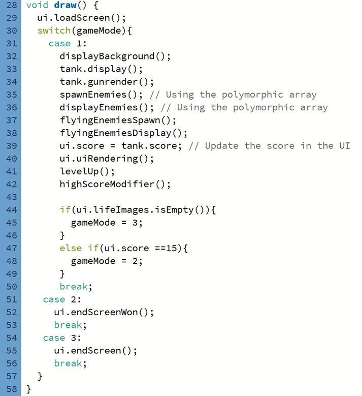
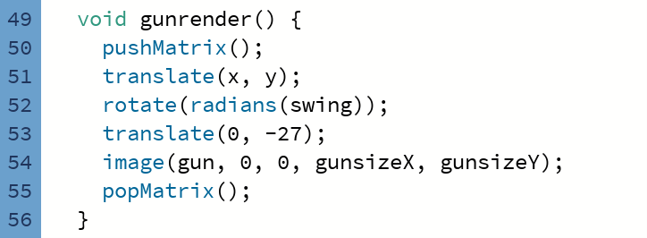
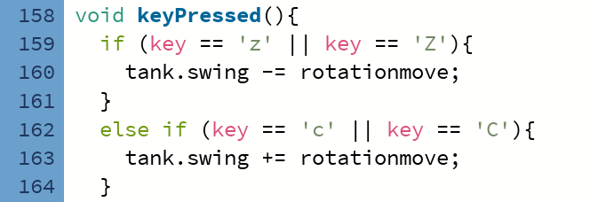
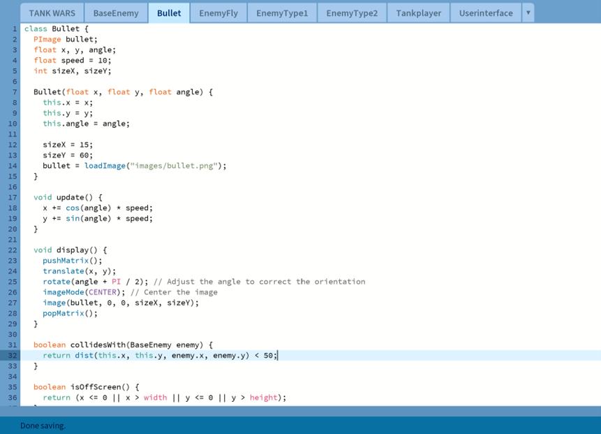
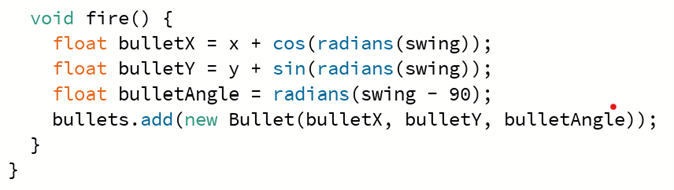
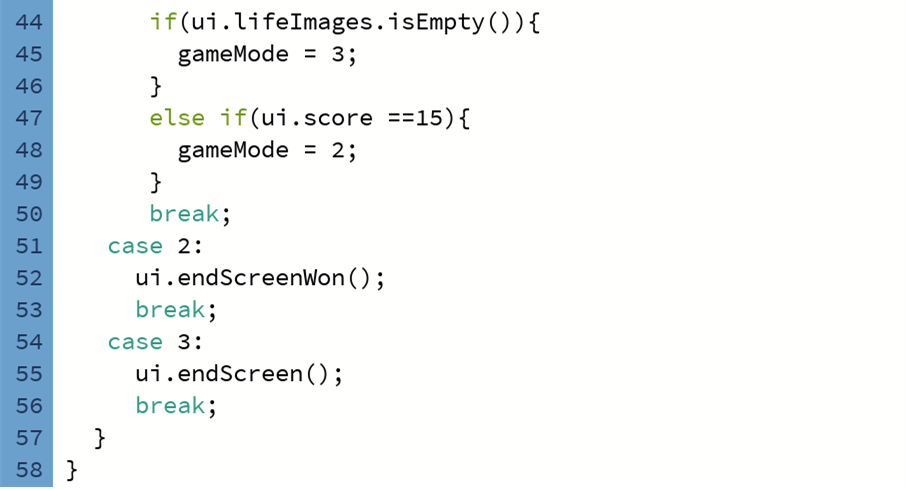
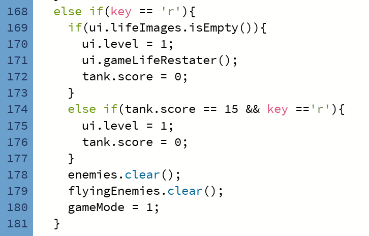

# Tank Wars

## Game Controls & Files

### Controls:
- **Left Arrow** → Move plane right
- **Right Arrow** → Move plane left
- **C Key** → Turn turret right
- **Z Key** → Turn turret left
- **Space Key** → Fire
- **ENTER Key** → Start game
- **R Key** → Restart game

### Files:
- **TANK_WARS** → Main game file.
- **HighScoreFile.txt** → Stores high scores.
- **images/** → Contains all game assets.

---

## Code Screenshots & Explanation

### Game Mode Navigation
Initially, I used an `if-else` statement for different game modes, but I later optimized it using `switch-case`, which made the logic more structured.

)

### Turret Rotation
One of the hardest challenges was implementing turret rotation. Despite using resources from Moodle and YouTube, I had to experiment with several adjustments to get it working correctly.

When a key is pressed, `rotationmove (5)` is added or subtracted from `swing`, which determines the turret's rotation angle. Before passing `swing` to the `rotate` function, it must be converted to radians for correct orientation.

---

### Bullet Mechanics
Initially, bullets did not align with the gun’s direction and behaved inconsistently. To fix this, I adjusted bullet instantiation within the `Tankplayer` class, ensuring that the angle values were correctly passed.

By refining the logic, I achieved a smooth projectile motion, improving the overall gameplay.

---

### Restarting the Game
A major issue occurred when restarting the game. The game checked if the player had lost by evaluating their lives in an `ArrayList`. If empty, the game ended. However, restarting didn’t properly reset values, causing a malfunction.

To resolve this, if the player presses `R` and `lifeImages` is empty, the score, level, and other data reset.

Additionally, the UI function restores three lives to the player.

---

### Enemy Spawning
I used the `millis()` function in Processing to track time for enemy spawning.

Two variables were introduced:
- `lastAddedTime`: Tracks when the last enemy spawned.
- `addInterval`: Defines enemy spawn frequency.

The difference between `millis()` and `lastAddedTime` determines whether a new enemy should be added. This mechanism ensures that enemies spawn at regular intervals, with spawn frequency adjusting as levels progress.

---

### Caps Lock Bug Fix
I encountered a small bug where key inputs failed when Caps Lock was enabled. The issue was resolved by using an `or` statement to handle both uppercase and lowercase inputs.

---

This README is now structured for clarity and proper Markdown formatting on GitHub. Let me know if you need any tweaks!
